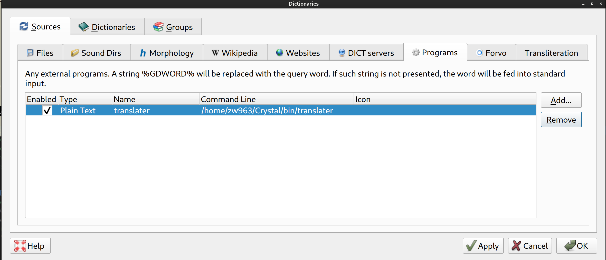

# translater

基于多翻译引擎的整句翻译命令行程序，仅支持 `中英`、`英中` 整句互译，会根据要翻译的语言自动判断。

目前支持如下如下引擎：

[阿里翻译](https://translate.alibaba.com)

[百度翻译](https://fanyi.baidu.com)

[必应翻译](https://www.bing.com/translator)

[腾讯翻译君](https://fanyi.qq.com)

[有道翻译](https://fanyi.youdao.com/index.html)

本工具适合中英文整句互译，如需翻译单词详细释义，请使用其他工具。

默认会随机选择一个支持的引擎来翻译，这可以避免过于频繁的使用某一翻译引擎而导致 IP 被封。

搭配 [goldendict](https://github.com/goldendict/goldendict) 作为词典之一，一起食用效果更佳！



```sh
 ╰─ $ bin/translater  'hello world!'
Using Ali
---------- Ali, spent 7.15 seconds use Firefox ----------
你好世界！

 ╰─ $ bin/translater  '那些杀不死你的，终将使你变得更强大'
Using Bing
---------- Bing, spent 6.07 seconds use Firefox ----------
What doesn't kill you will make you stronger
```

某一翻译引擎运行一次之后，如果再次选择该引擎，因为使用了浏览器 cache, 速度将得到极大提升！

在我本地测试，平均出翻译结果时间在两秒左右。

```sh
 ╰─ $ bin/translater -e ali  "Those who can't kill you will eventually make you stronger."
Using Ali
---------- Ali, spent 1.91 seconds use Firefox cache ----------
那些不能杀死你的人最终会让你更强大
 
 ╰─ $ bin/translater -e bing '你好，世界！'
Using Bing
---------- Bing, spent 2.90 seconds use Firefox cache ----------
Hello, world!
```

`translater --help` 获取有关参数的更多帮助。

## Arch Linux 安装

可以通过 Arch Linux 的 AUR 仓库安装 [translater-git](https://aur.archlinux.org/packages/translater-git) 或[自建源](https://github.com/taotieren/aur-repo)

```bash
yay -Syu translater
```

## Dependencies

### 火狐(Firefox)浏览器及 geckodriver (selenium driver for Firefox).

以 Arch Linux 为例：

```sh
$: pacman -S firefox geckodriver
```

或安装 Firefox 之后，自己下载 geckodriver，并拷贝至 /usr/local/bin

### Sqlite3

translater 使用 Sqlite3 保存缓存的 session，来加速翻译流程。

translster 同时还维护一个最快引擎的数据库，会自动记录每次不同引擎翻译的耗时，
可以使用 --profile 初始化数据库以及分析那个翻译引擎速度快一些。，见：--auto 以及 --profile 选项。

## Installation

从 [release 页面](https://github.com/crystal-china/translater/releases) 下载（单文件）最新版，
扔到 $PATH 的文件夹里，目前支持 Linux 和 OSX.

或者从源码编译安装：

```sh
$: make release
$: sudo make install
```

## TODO

1. 支持字节的火山翻译引擎, 当前，甚至非 headless 启动，手动输入翻译内容也不工作，字节，你真牛逼～

## Contributing

1. Fork it (<https://github.com/zw963/translater/fork>)
2. Create your feature branch (`git checkout -b my-new-feature`)
3. Commit your changes (`git commit -am 'Add some feature'`)
4. Push to the branch (`git push origin my-new-feature`)
5. Create a new Pull Request

## Contributors

- [Billy.Zheng](https://github.com/zw963) - creator and maintainer
